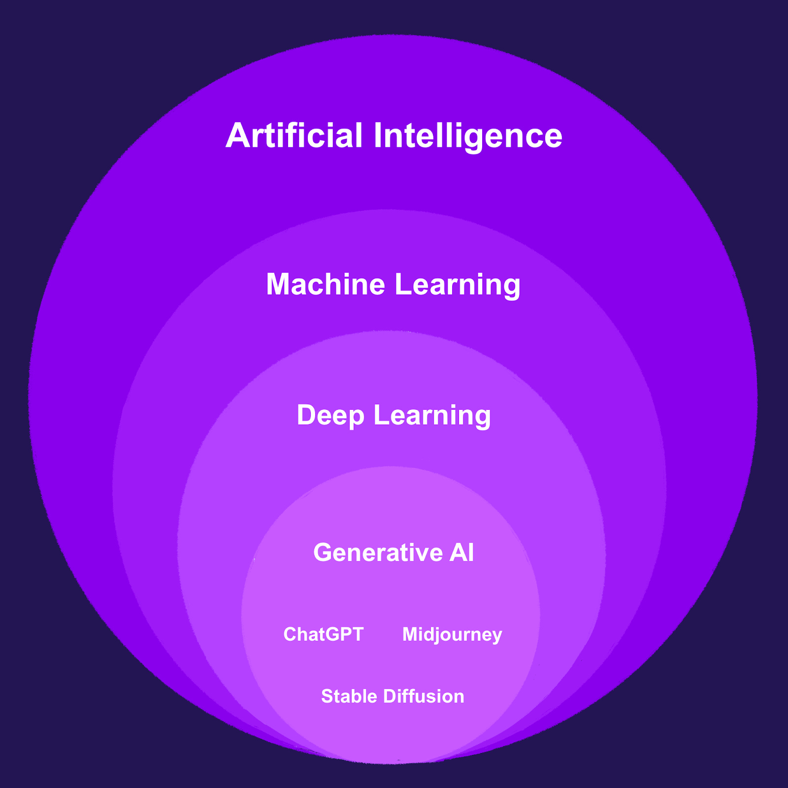

# Generative AI

This will be provide some useful information and content as I learn more and more about Generative AI space. Gather information from different sources and also showing some sample work which I have done so that you can learn and get deeper as you would like. 

**Where Generative AI sits within AI**

[Source](https://blog.nami.gg/p/how-generative-ai-can-charge-web3)

# MindMaps

Created some mind maps to keep the knowledge graph in your minds and would also aid in easy ramp ups. Will keep updating it. 

- [MindMaps on Generative AI](https://github.com/bertieucbs/genai-learning/tree/main/mindmaps) 

# Tutorials in AWS for Generative AI JumpStart Foundation Models

- [AWS JumpStart Foundation Models](https://github.com/aws/amazon-sagemaker-examples/tree/main/introduction_to_amazon_algorithms/jumpstart-foundation-models)

# Fundamentals Learnings

Some starters

- [Understanding Large Language Models](https://medium.com/mlearning-ai/understanding-large-language-models-6664be71988e) - Gentle intro
- [Generative AI with Large Language Models](https://www.coursera.org/learn/generative-ai-with-llms/) - Free course on coursera, one of the best to start with
- [LLM University](https://docs.cohere.com/docs/llmu)
- [Prompt Engineering Complete Guide](https://medium.com/@fareedkhandev/prompt-engineering-complete-guide-2968776f0431)
- [Introduction to Large Language Models and the Transformer Architecture](https://rpradeepmenon.medium.com/introduction-to-large-language-models-and-the-transformer-architecture-534408ed7e61)
- [Choosing the Right Embedding Model: A Guide for LLM Applications](https://medium.com/@ryanntk/choosing-the-right-embedding-model-a-guide-for-llm-applications-7a60180d28e3)
- [What is a vector database?](https://technotes2023.medium.com/what-is-a-vector-database-fa1b649c7755)
- [Vector Databases: A Beginner’s Guide!](https://medium.com/data-and-beyond/vector-databases-a-beginners-guide-b050cbbe9ca0)
- [RAG vs Finetuning — Which Is the Best Tool to Boost Your LLM Application?](https://towardsdatascience.com/rag-vs-finetuning-which-is-the-best-tool-to-boost-your-llm-application-94654b1eaba7)
- 

Below are some handpicked resources I found useful where you can learn some fundamentals 

- [How ChatGPT actually works](https://www.assemblyai.com/blog/how-chatgpt-actually-works/)
- [Use Amazon SageMaker to Build Generative AI Applications- AWS Virtual Workshop](https://www.youtube.com/watch?v=DgTHEvvpvMI)
- [MIT Introduction to Deep Learning | 6.S191](https://www.youtube.com/watch?v=QDX-1M5Nj7s)
- [Introduction to Facebook AI Similarity Search (Faiss)](https://www.pinecone.io/learn/faiss-tutorial/)
- [What is Similarity Search?](https://www.pinecone.io/learn/what-is-similarity-search/)
- [What is a Vector Database?](https://www.pinecone.io/learn/vector-database/)
- [Vector Embeddings for Developers: The Basics](https://www.pinecone.io/learn/vector-embeddings-for-developers/)

# Links of interest
- [Metric: rouge](https://huggingface.co/spaces/evaluate-metric/rouge)
- [Prompt Engineering Guide](https://www.promptingguide.ai/)
- [HELM](https://crfm.stanford.edu/helm/latest/)

# Misc. 

-  [Why AI Is Incredibly Smart — and Shockingly Stupid | Yejin Choi | TED](https://www.youtube.com/watch?v=SvBR0OGT5VI)
-  [MiniGPT-4: ChatGPT for your images](https://pub.towardsai.net/minigpt-4-chatgpt-for-your-images-ac111a5b288a)
- [Beyond ChatGPT: The Future of Generative AI for Enterprises](https://www.gartner.com/en/articles/beyond-chatgpt-the-future-of-generative-ai-for-enterprises)

